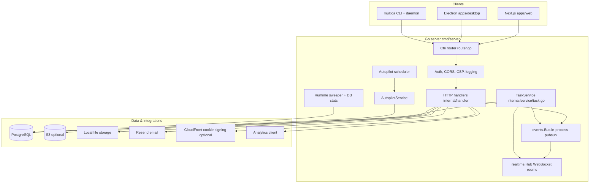

# Multica — system architecture

## 1. Product shape

Multica is an **AI-native issue and agent operations platform**: humans and coding agents share workspaces, issues, comments, skills, and runtimes. The server orchestrates **task queues**, **WebSocket fan-out**, and **background schedulers**; clients (web, desktop, CLI daemon) execute agent work and report progress.

Canonical high-level stack (from `CLAUDE.md` and `README.md`):

- **Backend:** Go 1.26+, Chi HTTP router, PostgreSQL via `pgx` + `sqlc`, Gorilla WebSocket hub.
- **Frontend monorepo:** pnpm workspaces + Turborepo; Next.js (web), Electron (desktop), shared `packages/core`, `packages/views`, `packages/ui`.

## 2. Logical architecture

### 2.1 Request path (HTTP)

1. **Global middleware:** request ID, client metadata, structured logging, panic recovery, Content-Security-Policy, CORS (`server/cmd/server/router.go`).
2. **Auth partitions:**
   - **Public:** health, auth code flow, Google login, `/api/config`.
   - **Daemon:** `/api/daemon/*` with daemon token or equivalent (`middleware.DaemonAuth`).
   - **User:** JWT (and PAT for WS) + workspace membership for workspace-scoped routes (`middleware.Auth`, `RequireWorkspaceMember`, role gates).
3. **Handlers** delegate to `sqlc`-generated queries and services (`internal/handler`).

### 2.2 Real-time path (WebSocket)

- Endpoint: `GET /ws` (`router.go`).
- **Hub** (`internal/realtime/hub.go`) maintains **rooms keyed by workspace UUID**, registers clients with JWT or PAT resolution, and broadcasts JSON events.
- **Origin allowlist** is shared with CORS via `realtime.SetAllowedOrigins`.
- Daemon-originated task progress uses the same event vocabulary as the web app (`server/pkg/protocol/events.go`).

### 2.3 Domain events (in-process)

- **`events.Bus`** (`internal/events/bus.go`) is a **synchronous, in-memory** pub/sub keyed by event type string (e.g. `issue:created`).
- **Listeners** in `cmd/server/*_listeners.go` bridge domain events to:
  - activity log rows,
  - inbox notifications,
  - subscriber fan-out,
  - analytics hooks,
  - autopilot run completion.
- Ordering constraint (documented in `main.go`): subscriber listeners register **before** notification listeners so recipient lists are consistent within one `Publish` call.

## 3. Agent execution architecture

### 3.1 Roles

| Component | Responsibility |
|-----------|----------------|
| **Server** | Authoritative state: issues, agents, runtimes, task rows, scheduling, auth, WS broadcast. |
| **Daemon (CLI)** | Long-lived process paired to a workspace runtime: claims tasks, spawns agent CLIs, streams messages, completes/fails tasks. |
| **Agent backends (`server/pkg/agent`)** | Uniform `Backend` interface over Claude, Codex, Copilot, OpenCode, OpenClaw, Hermes, Gemini, Pi, Cursor, Kimi — subprocess + JSON/stream parsing. |

### 3.2 Runtime model

- **`agent_runtime`** (migration `004_agent_runtime_loop.up.sql`) is the **unit of connectivity**: a daemon registers against a runtime row; multiple **agents** can share one runtime (`agent.runtime_id`).
- **`agent_task_queue.runtime_id`** ensures pending work is claimed **per machine/daemon context**, not only per logical agent.
- **Claim path:** `TaskService.ClaimTaskForRuntime` lists pending tasks for a runtime, then iterates distinct agents and calls `ClaimTask`, which enforces **`max_concurrent_tasks`** before a single-row atomic claim (`internal/service/task.go`).

### 3.3 Task lifecycle (conceptual)

States in DB (from initial migration + later guards): `queued` → `dispatched` → `running` → `completed` | `failed` | `cancelled` (plus `dispatched` as an intermediate claim state depending on query definitions).

**Important product invariant (from `TaskService` comments):** issue status is **not** auto-flipped on task start/complete; the agent/tooling is expected to update issue state via the product API or CLI.

### 3.4 Background workers (`cmd/server/main.go`)

- **`runRuntimeSweeper`:** marks stale runtimes offline and reconciles orphaned tasks (implementation in related files under `cmd/server`).
- **`runAutopilotScheduler`:** ticks schedule triggers via `ClaimDueScheduleTriggers` SQL and `AutopilotService`.
- **`runDBStatsLogger`:** operational visibility for connection pool stats.

## 4. Frontend architecture

### 4.1 Package boundaries

- **`packages/core`:** TanStack Query for server state, Zustand for client-only state, API client, WebSocket client, domain modules (`issues`, `chat`, `runtimes`, `autopilots`, etc.) — **no** `next/*` or `react-router-dom` imports.
- **`packages/views`:** Composes screens from `core` + `ui`.
- **`packages/ui`:** shadcn-style primitives (Tailwind v4 in catalog).
- **`apps/web`:** Next.js App Router, wraps `CoreProvider` from `packages/core/platform`.
- **`apps/desktop`:** Electron + Vite; same core provider pattern.

### 4.2 State rules (architectural contract)

From `CLAUDE.md`:

- Server data lives in **React Query** only; WS handlers **invalidate** queries, they do not duplicate rows into Zustand.
- Workspace-scoped query keys include **`wsId`** for correct cache isolation on switch.
- Mutations default to **optimistic** updates with rollback.

## 5. CLI / multica binary

- **`server/cmd/multica`:** Cobra-based CLI: workspace, agent, daemon, attachment, auth, config, autopilot helpers, etc.
- **Daemon** communicates with server via `/api/daemon/*` using daemon authentication (`router.go`).

## 6. Security and compliance surfaces

- **JWT** for sessions (`github.com/golang-jwt/jwt/v5`); production requires `JWT_SECRET`.
- **Personal Access Tokens** hashed at rest; WS can authenticate via PAT resolver (`router.go` `patResolver`).
- **CSP middleware** for browser clients (`internal/middleware/csp.go`).
- **Uploads:** S3 preferred from env; else local filesystem with `/uploads/*` static route when `LocalStorage` is active.

## 7. Deployment modes

- **Local dev:** `make dev` — Postgres (often `pgvector/pgvector:pg17`), migrate, run server + frontend.
- **Self-hosted:** documented in `SELF_HOSTING.md` / `SELF_HOSTING_AI.md`; Docker images and GHCR tags.
- **Cloud:** product-hosted variant (`multica.ai`); same codebase paths, environment-driven integrations (Resend, S3, CloudFront, analytics).

## 8. Extension points

- **New agent type:** implement `agent.Backend` in `server/pkg/agent`, register in `agent.New`, teach daemon detection/launch headers.
- **New HTTP capability:** handler + `sqlc` query + migration + core API module + optional WS event in `pkg/protocol`.
- **New scheduled behavior:** autopilot triggers or additional cron-like workers following `autopilot_scheduler.go` patterns.
