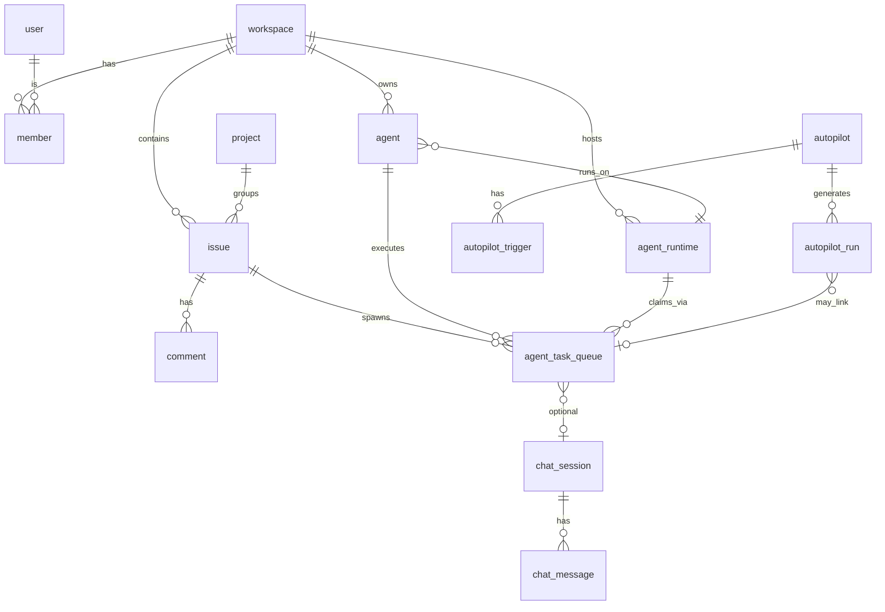

# Multica — database schema

**Engine:** PostgreSQL (CI and docs reference **pgvector/pgvector:pg17**; some features use optional extensions).

**Access pattern:** SQL migrations in `server/migrations/`; application code uses **`sqlc`**-generated types and queries in `server/pkg/db/generated/` and `server/pkg/db/queries/`.

## 1. Extensions

| Extension | Purpose |
|-----------|---------|
| `pgcrypto` | `gen_random_uuid()` and cryptographic helpers (`001_init.up.sql`). |
| `pg_bigm` (optional) | Bigram GIN indexes for CJK-friendly substring search on issues (`032_issue_search_index.up.sql`); skipped if unavailable. |

## 2. Core identity and tenancy

### 2.1 `user`

- Human accounts: name, email (unique), avatar, timestamps.
- Later migrations add **onboarding**, **starter content**, **cloud waitlist**, **`onboarded_at`** flags (see migrations `050`, `051`–`054`, etc.).

### 2.2 `workspace`

- Tenant root: name, **slug** (unique), description, **settings** JSONB.
- **Issue numbering:** `issue_prefix`, `issue_counter` (`020_issue_number.up.sql`).
- **Repos list:** `repos` JSONB (`014_workspace_repos.up.sql`) for daemon/repo context.

### 2.3 `member`

- Join table: `workspace_id`, `user_id`, **role** ∈ `owner` | `admin` | `member`.

### 2.4 `workspace_invitation` (`041_workspace_invitation.up.sql`)

- Pending invites by email; unique pending per `(workspace_id, invitee_email)`; expiry default 7 days.

## 3. Agents and runtimes

### 3.1 `agent`

- Belongs to `workspace_id`; **name**, **avatar_url**, **runtime_mode** (`local` | `cloud`), **runtime_config** JSONB, **visibility**, **status** (`idle` | `working` | `blocked` | `error` | `offline`), **max_concurrent_tasks**, **owner_id**.
- **`runtime_id`** FK → `agent_runtime` (**NOT NULL** after migration `004`).
- Evolutions: **instructions**, **custom args**, **custom env**, **MCP config** JSON, **model** selection, **archive** (`archived_at`), **default private visibility**, **unique name per workspace** (migrations `021`, `041`, `040`, `046`, `050`, `031`, `046`).

### 3.2 `agent_runtime`

- Physical/logical execution endpoint: `workspace_id`, optional **`daemon_id`**, **name**, **runtime_mode**, **provider** string, **status** (`online` | `offline`), **device_info**, **metadata** JSONB, **`owner_id`** (user), **`last_seen_at`**.
- Unique `(workspace_id, daemon_id, provider)` (nullable `daemon_id` semantics per migration).

### 3.3 `daemon_connection`

- Links `agent_id`, `daemon_id`, connection **status**, heartbeat, **runtime_info** JSONB.
- Unique `(agent_id, daemon_id)` (`003_task_context.up.sql`).

## 4. Work tracking

### 4.1 `project` (`034_projects.up.sql`)

- Workspace-scoped initiative: title, description, icon, **status**, optional **lead_type** / **lead_id** (member or agent).
- **Priority** added in `035_project_priority.up.sql`.

### 4.2 `issue`

- **Workspace-scoped** task: title, description, **status** (Linear-style workflow), **priority**, assignee (**member** or **agent**), creator type/id, optional **parent_issue_id**, **acceptance_criteria** / **context_refs** JSONB, **position**, **due_date**, **`number`** + UNIQUE `(workspace_id, number)`.
- **project_id** FK nullable (`034`).
- **origin_type** / **origin_id** for autopilot-created issues (`042`).
- Search indexes: optional `pg_bigm` GIN on title/description (`032`).
- **first_executed_at** and other analytics-friendly columns (`050_issue_first_executed_at`).

### 4.3 Labels and dependencies

- **`issue_label`**, **`issue_to_label`** (many-to-many).
- **`issue_dependency`**: `blocks` | `blocked_by` | `related`.

### 4.4 `issue_subscriber`

- Users following an issue (migration `015` + backfill `016`).

## 5. Collaboration

### 5.1 `comment`

- **issue_id**, author type/id, **content**, **type** (`comment`, `status_change`, `progress_update`, `system`).
- **parent_id** for threading (`017`); **workspace_id** denormalized (`025`) for ACL/search.

### 5.2 Reactions

- **`comment` reactions** (`026_comment_reactions.up.sql`).
- **`issue` reactions** (`027_issue_reactions.up.sql`).

### 5.3 `attachment` (`029_attachment.up.sql`)

- File metadata: workspace, optional issue/comment, uploader type/id, filename, **url**, content type, size.

## 6. Agent task queue

### 6.1 `agent_task_queue`

**Columns (evolved across migrations):**

- Core: `agent_id`, **`runtime_id`**, **`issue_id` (nullable** for chat tasks), **status**, **priority**, timestamps for dispatch/start/complete, **result** JSONB, **error** text.
- **context** JSONB (legacy snapshot; product comment: agents fetch live context via CLI) (`003`).
- **trigger_comment_id** for mention/comment-triggered runs (`028` and related).
- **Chat:** `chat_session_id` FK (`033`).
- **Autopilot:** `autopilot_run_id` FK (`042`).
- **Usage / session:** task usage reporting, **session** linkage (`020_task_session`, `032_task_usage` — see migrations list).
- **Lease / retry:** `attempt`, `max_attempts`, `parent_task_id`, `failure_reason`, `last_heartbeat_at` (`055_task_lease_and_retry.up.sql`).

**Indexes (representative):**

- Pending poll: `(runtime_id, priority DESC, created_at)` partial where status ∈ `queued`/`dispatched` (`004`).
- Per-agent pending: `(agent_id, …)` partial (`003`).

## 7. Inbox and activity

### 7.1 `inbox_item`

- Recipient (**member** or **agent**), **type**, **severity**, optional `issue_id`, read/archived flags, title/body, **`details` JSONB** (`019_inbox_details`), **actor** fields (`012_inbox_actor`).

### 7.2 `activity_log`

- Workspace-scoped audit stream: optional `issue_id`, actor, **action** string, **details** JSONB.

## 8. Skills

Structured skills (`008_structured_skills.up.sql`):

- **`skill`:** workspace, unique `(workspace_id, name)`, description, **content**, **config** JSONB.
- **`skill_file`:** many files per skill (path + content), unique `(skill_id, path)`.
- **`agent_skill`:** many-to-many agent ↔ skill.

## 9. Chat

- **`chat_session`:** workspace, agent, creator user, title, **`session_id` / `work_dir`** resume pointers, status (`033`).
- **`chat_message`:** session, role (`user` | `assistant`), content, optional `task_id`.
- Unread tracking: **`chat_unread_since`** or related columns (`040_chat_unread`).

## 10. Pins

- **`pinned_item`** (migration `038`): user/workspace scoped shortcuts to issues, projects, etc.

## 11. Autopilot

Tables from `042_autopilot.up.sql`:

- **`autopilot`:** workspace, optional `project_id`, title, **assignee_id** (agent), priority, status (`active` | `paused` | `archived`), **execution_mode** (`create_issue` | `run_only`), **issue_title_template**, **concurrency_policy** (`skip` | `queue` | `replace`), creator type/id, **last_run_at**.
- **`autopilot_trigger`:** `kind` ∈ `schedule` | `webhook` | `api`, cron fields, timezone, **next_run_at**, **webhook_token**, enabled flag.
- **`autopilot_run`:** links to trigger, **source**, **status**, optional `issue_id` / `task_id`, payload/result JSONB, timestamps.

## 12. Auth tokens

- **`personal_access_token`:** hashed token, user_id, label, last_used (`011`).
- **`verification_code` / attempts** for email login (`009`, `010`).
- **Daemon token** migration (`029_daemon_token.up.sql`) — daemon auth storage.

## 13. Search artifacts

- **Issue search:** `pg_bigm` GIN where installed (`032`); additional **lower** normalization (`036_search_index_lower`).
- **Comment search index** (`033_comment_search_index.up.sql`).
- **Project search index** (`039_project_search_index.up.sql`).

## 14. Runtime settings

- **`057_runtime_settings.up.sql`** (and related): per-runtime JSON settings surfaced to daemon/UI.

## 15. ER diagram (simplified)

## 16. Migration hygiene

- Migrations are **sequential** `NNN_description.up.sql` / `.down.sql`.
- Some migrations use **defensive `DO $$ … EXCEPTION`** blocks for optional extensions (search).
- **Data repair migrations** exist (e.g. `043_fix_orphaned_autopilot_runs`, reserved slug audits `043`–`056`).

For **generated Go types**, prefer reading `server/pkg/db/generated/models.go` after running `make sqlc` — it is the compiled view of the live schema the server expects.
