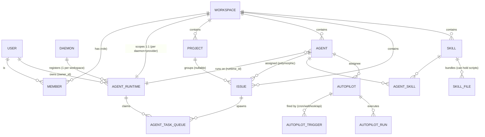
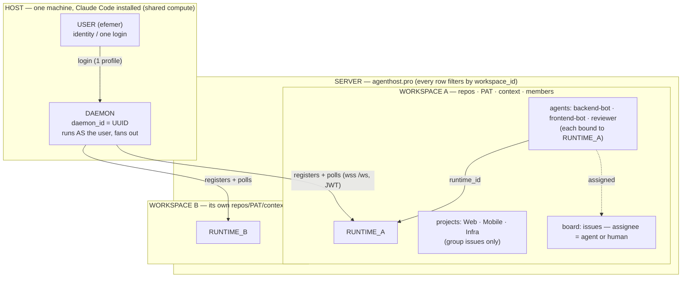
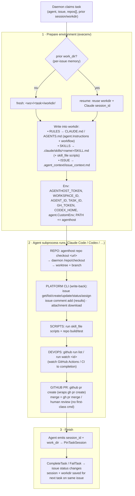
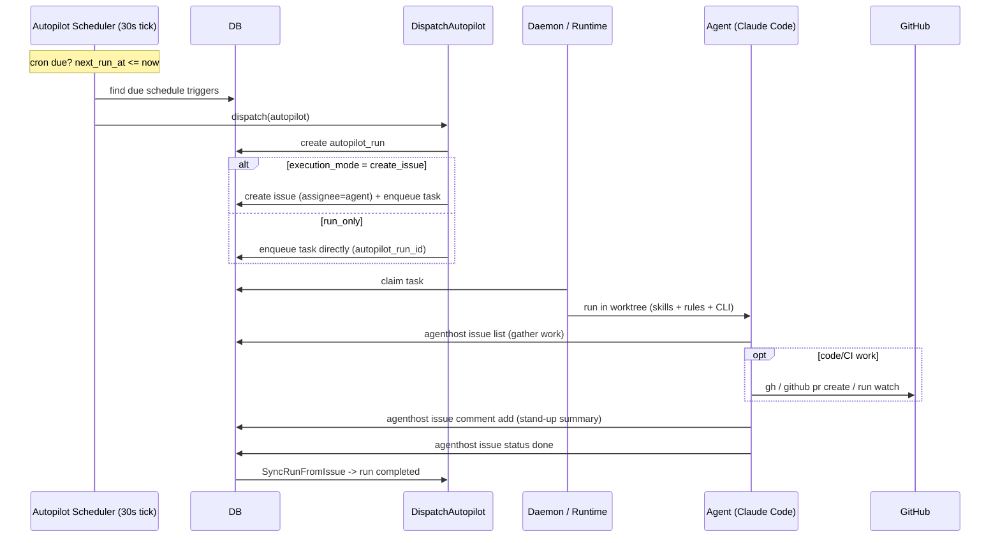

# Runtime Topology & Agent Execution Map

> **Audience:** Anyone reasoning about how daemons, runtimes, workspaces, projects, agents, and users relate — and how an agent actually executes a task (repo, memory, rules, skills, scripts, DevOps, PRs, automation).
>
> **Companion:** [kensink-runtime.md](./kensink-runtime.md) covers install/ops. This doc is the *model*.
>
> Every claim here is grounded in code; key files are cited inline. Symbols: `1` one · `*` many · `1:1` exactly-one-each.

---

## Entity glossary

| Entity | What it is | Scope |
|---|---|---|
| **User** | A person (identity, login). | Global; member of many workspaces. |
| **Daemon** | A process on a machine (`daemon_id` = persistent UUID). Runs **as a user**. | **Spans every workspace the user belongs to** — the only cross-workspace entity. |
| **Runtime** | `agent_runtime` row — a registered executor inside one workspace. | **1:1 with a workspace** (`workspace_id NOT NULL`, `UNIQUE(workspace_id, daemon_id, provider)`). |
| **Workspace** | Tenant / isolation unit. Owns `repos[]`, GitHub PAT, `context`, members, agents, projects, issues. | The hard boundary; everything filters by `workspace_id`. |
| **Project** | `project` row — groups issues (`issue.project_id`, nullable). | Inside a workspace; **invisible to the daemon/runtime**; owns no repos/PAT/config. |
| **Agent** | `agent` row — an AI assignee. Carries `Instructions`, `Skills`, `CustomEnv`, `Model`. | Workspace-scoped; bound to one runtime (`agent.runtime_id`). The per-"project" config lever. |
| **Task** | `agent_task_queue` row — one unit of work for an agent on an issue. | Tied to `runtime_id` + `issue_id` + `agent_id`; runs in its own git worktree. |

---

## Map 1 — Relationship / ER



> `DAEMON` is a process, not a table — shown here because it owns the registration relationship. Everything else is a real table.

---

## Map 2 — Deployment topology (one daemon, many workspaces)



**The five non-obvious truths:**
1. A **runtime is 1:1 with a workspace** — to "share a runtime across projects," projects must live in one workspace (one runtime serves all) or each be its own workspace (one runtime each).
2. The **daemon is the only entity that crosses workspaces** — and only across workspaces the *same user* is a member of.
3. A **project is just a label on issues** — its `project_id` never reaches the daemon; the runtime can't see it.
4. The **agent is the per-"project" config lever** (`Instructions` → `CLAUDE.md`, `CustomEnv`, `Model`). `workspace.context` exists but is **orphaned/unused**.
5. **Isolation today = a git worktree per task.** No container/DevOps boundary.

---

## Map 3 — Scope of operation

| Entity | Spans / sees | Hard boundary |
|---|---|---|
| **User** | every workspace it's a member of | — |
| **Daemon** | **all** workspaces of its user (fan-out) | the user's memberships |
| **Runtime** | exactly **one** workspace | cannot cross a workspace (1:1) |
| **Workspace** | repos · PAT · context · members · agents · projects · issues | **the tenancy / isolation unit** |
| **Project** | the issues grouped under it | invisible to daemon/runtime; owns no repos/PAT/config |
| **Agent** | one workspace; one runtime | per-agent Instructions/Env/Model = the only per-"project" config lever |
| **Task** | one issue | runs in its **own** git worktree + branch |

---

## Map 4 — Task execution scope (filesystem isolation)

The daemon runs the AI tool as a **host subprocess** (`exec.CommandContext`, `cmd.Dir`, `cmd.Env` — [codex.go:102](../server/pkg/agent/codex.go#L102)). The only isolation boundary is the git worktree.

```text
HOST filesystem (one daemon):

  <workspacesRoot>/
    .repos/<workspaceID>/<repo-hash>/        ← shared BARE clone   (per-repo mutex)
    <workspaceID>/<taskId>/workdir/          ← PER-TASK env root
        <repo>/                              ←   git worktree, branch agent/<agent>/<task>
        .claude/skills/<name>/SKILL.md       ←   skills (provider-native path)
        CLAUDE.md | AGENTS.md | GEMINI.md    ←   meta-skill (identity, rules, CLI ref)
        .agent_context/issue_context.md      ←   the issue

  GATE at claim time: task.workspace_id MUST equal runtime.workspace_id
```

Concurrent tasks get **separate worktrees + branches**; the shared bare clone is guarded by a per-repo mutex ([repocache/cache.go](../server/internal/daemon/repocache/cache.go), [execenv/git.go:70](../server/internal/daemon/execenv/git.go#L70)). Up to 20 concurrent tasks per daemon.

---

## Map 5 — How an agent executes a task

Repo · memory · rules · skills · scripts · DevOps · PR — the full data flow.



**What each capability actually is (verdict + source):**

| Capability | Status | Mechanism |
|---|---|---|
| **Repo** | ✅ complete | `agenthost repo checkout <url>` → daemon `/repo/checkout` → bare clone + per-task worktree/branch ([cmd_repo.go:32](../server/cmd/multica/cmd_repo.go#L32)). Repo must be in `workspace.repos`. |
| **Rules / instructions** | ✅ complete | `agent.Instructions` injected into `CLAUDE.md`/`AGENTS.md`/`GEMINI.md` meta-skill ([runtime_config.go:48](../server/internal/daemon/execenv/runtime_config.go#L48)). |
| **Memory** | ⚠️ per-issue only | `agent_task_queue.session_id` + `work_dir` reused on the next task **for the same issue** ([execenv reuse](../server/internal/daemon/daemon.go#L1246)). **No** cross-issue or workspace memory store. `workspace.context` is orphaned. |
| **Skills** | ✅ complete | `skill` + `skill_file` (+ `agent_skill` M:N) written to provider-native skill paths. `skill_file` can hold executable **scripts** ([008_structured_skills](../server/migrations/008_structured_skills.up.sql)). |
| **Scripts** | ✅ complete | Skill-file scripts + repo build/test, run as subprocesses in the worktree. The agent's platform toolbox is the `agenthost` CLI (issue/comment/repo/github/autopilot/…). |
| **DevOps pipelines** | ⚠️ watch-only | `agenthost github run list` / `run watch <id>` watches GitHub Actions/CI to completion ([cmd_github.go](../server/cmd/multica/cmd_github.go)). No pipeline is auto-triggered or auto-posted by the platform. |
| **GitHub PR** | ⚠️ create-only | `github pr create` (wraps `gh pr create`) is first-class. **No `pr merge` subcommand** — merge via raw `gh pr merge` or human review. No auto-merge, no auto CI-comment. |

---

## Map 6 — Automation: autopilot & the "project stand-up"

A stand-up is **not a built-in feature** — it's a **pattern**: a scheduled **autopilot** assigned to an agent that gathers issues and posts a summary comment. The scheduling/dispatch engine is fully built; the summary *content* is the agent's skill.



**Engine pieces (all real):**
- `autopilot` — assignee=agent, `execution_mode` = `create_issue` | `run_only`, `concurrency_policy` = `skip|queue|replace`, optional `project_id` ([042_autopilot](../server/migrations/042_autopilot.up.sql)).
- `autopilot_trigger` — `kind` = `schedule|webhook|api`, `cron_expression`, `timezone`, `next_run_at`. (`schedule` is fully wired; `webhook/api` are scaffolded.)
- `autopilot_run` — `source`, `status`, links → `issue_id` + `task_id`.
- **Scheduler goroutine** polls every 30s for due cron triggers ([autopilot_scheduler.go](../server/cmd/server/autopilot_scheduler.go), started at [main.go:116](../server/cmd/server/main.go#L116)). `ComputeNextRun(cron, tz)` advances the schedule.

**Recipe — daily project stand-up (today, no code changes):**
1. Create an **agent** (e.g. `standup-bot`) with `Instructions`: *"List open/in-progress issues, summarize movement since yesterday, flag blockers, post one comment."*
2. Give it a **skill** that scripts the gather step (`agenthost issue list --status in_progress …`) and the summary format.
3. Create an **autopilot** assigned to `standup-bot`, `execution_mode = create_issue` (title template "Stand-up {date}"), `concurrency_policy = skip`.
4. Add a **schedule trigger**, e.g. cron `0 9 * * 1-5`, timezone your team's.
5. The scheduler fires → issue created → task dispatched → agent gathers + posts the stand-up comment → run marked complete.

---

## Capability status (at a glance)

| Area | Status | Gap |
|---|---|---|
| Repo checkout / worktrees | ✅ complete | — |
| Skills delivery (+ scripts) | ✅ complete | — |
| Rules / instructions | ✅ complete | — |
| Memory | ⚠️ partial | per-issue session only; no cross-issue/workspace memory; `workspace.context` orphaned |
| Agent platform CLI | ✅ complete | — |
| GitHub PR | ⚠️ partial | create only; no auto-merge, no auto CI-post |
| DevOps pipelines | ⚠️ partial | watch/list only; nothing auto-triggered by the platform |
| Autopilot scheduling | ✅ complete | webhook/api triggers scaffolded, not fully wired |
| Daily stand-up | 🟡 pattern | engine exists; summary is an agent skill, not a built-in |
| Per-project repo/PAT/config | ❌ not built | repos/PAT/context are workspace-level only |
| Container / DevOps isolation | ❌ not built | worktree-only; cloud runtime is a waitlist stub |
